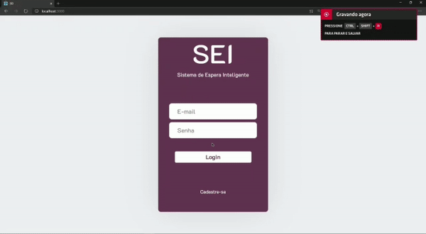
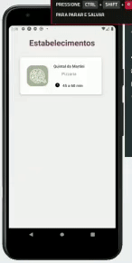
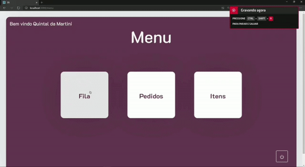

# SEI

O projeto Sistema de Espera Inteligente (SEI) será um aplicativo utilizado em filas de espera para avisar quando é a vez dos clientes, além de antecipar o seu pedido.

## Contexto

A ideia do projeto é fazer um aplicativo que faça esse serviço só que de forma melhorada em que o cliente poderá ver exatamente qual a sua posição na fila e também antecipar o atendimento em um restaurante, no qual o cliente poderá ver com antecedência o cardápio, sendo que a partir de uma determinada posição na fila ele já poderá fazer seu pedido de maneira que quando ele se sentar na mesa a sua comida não demoraria muito mais para chegar, o que melhora a experiência do cliente aumentando sua satisfação, e do ponto de vista do empresário aumenta a eficiência do serviço e aumenta a rotatividade, logo gera mais lucro.

## Justificativa

Em vários estabelecimentos são encontradas filas de espera, em que as pessoas podem esperar desde alguns minutos até algumas horas como em lugares com alta demanda. Essa situação sempre gera dois sentimentos nos proprietários: satisfação pelo seu empreendimento ser procurado pelos clientes, e o medo de que estejam insatisfeitos com a possível demora no atendimento. Se não é possível acabar com esse problema, ao menos é preciso saber contorná-lo. Por isso, é essencial planejar o atendimento de modo a evitar filas longas e esperas e, manter a satisfação e fidelidade do cliente que já conhecem e frequentam o seu estabelecimento, e principalmente automatizar o gerenciamento de espera com a tecnologia, tornando a experiência do cliente muito melhor.

## Objetivo

### Objetivo Geral:

- Alcançar a maior eficiência dos espaços que os clientes visitam;
-	Melhorar a experiência dos clientes em filas de espera dos estabelecimentos;
-	Aumentar a rotatividade do estabelecimento.

## Interface

- Tela de cadastro do restaurante e Tela de Login;

- Interface mobile

- Confirmação da entrada do cliente e Temporizador

## Integrantes

- Caroline Maria Nunes Bol - carolinemariabol@gmail.com
- Isabela Sobral Porpino Paes Barreto - isa.porpino@gmail.com
- Lucas da Silva Freitas - lucasdasilvafreitas090@gmail.com
- Luiz Ricardo Bragança da Silva - lurbraganca@hotmail.com

https://github.com/olucasfreitas/SEI
